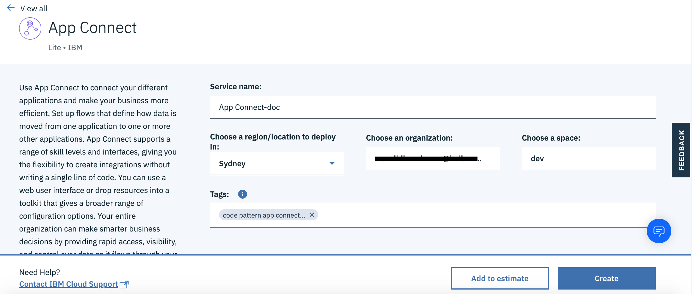
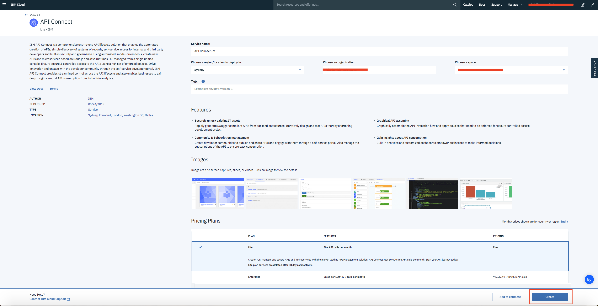
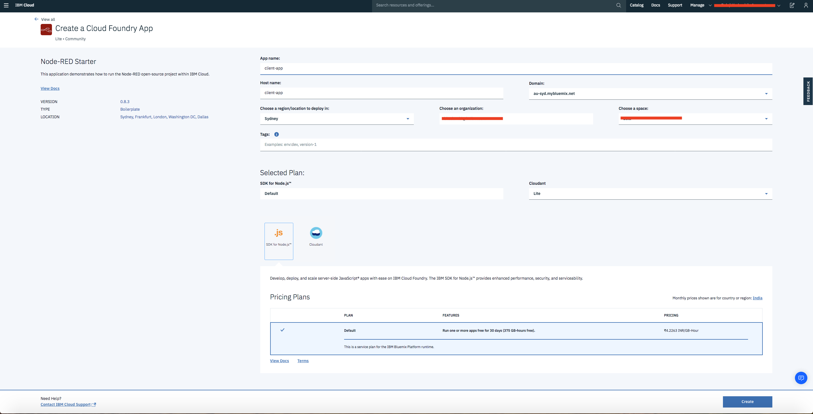
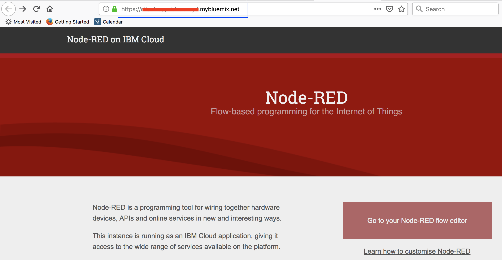
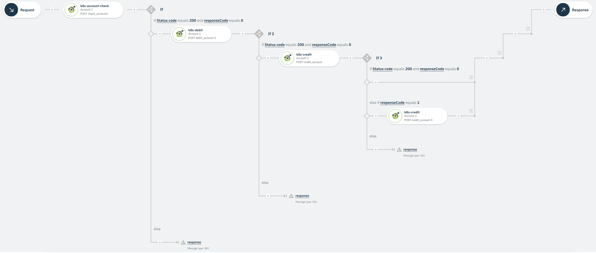
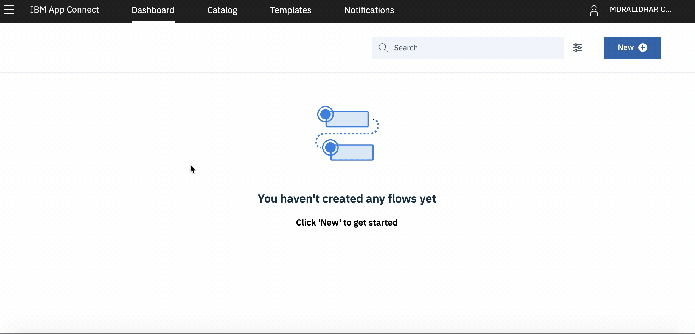
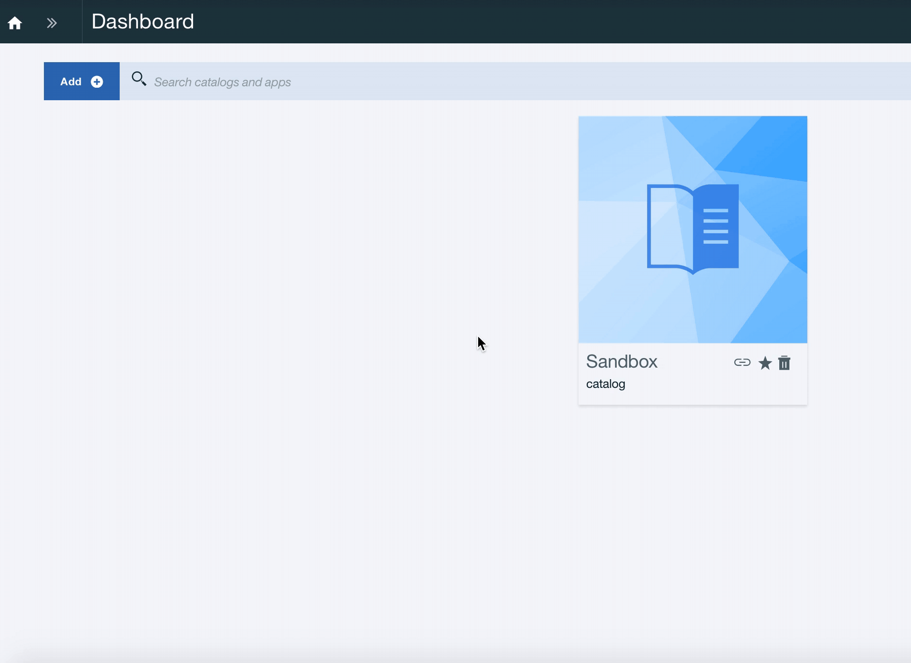
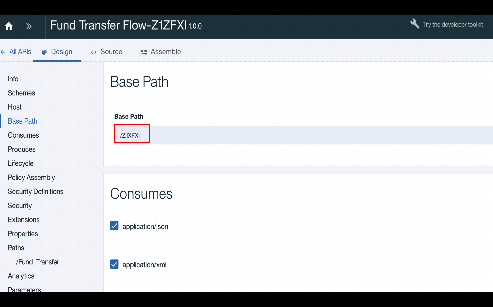
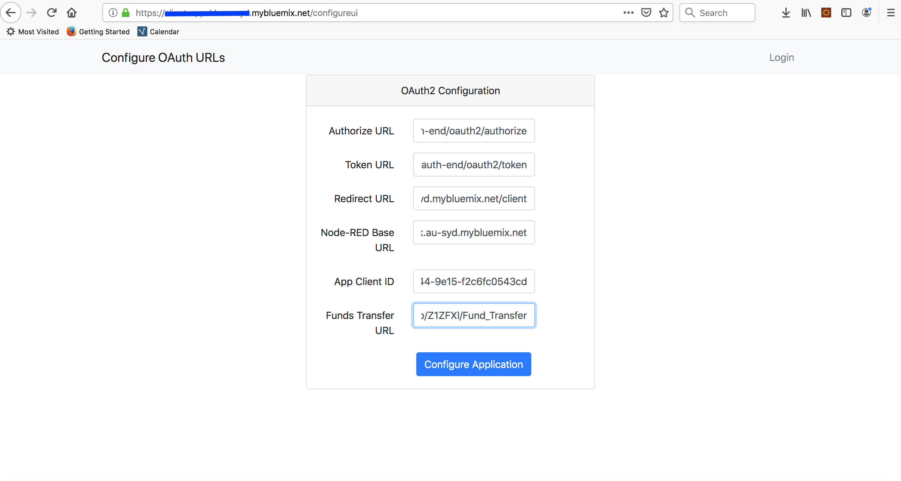
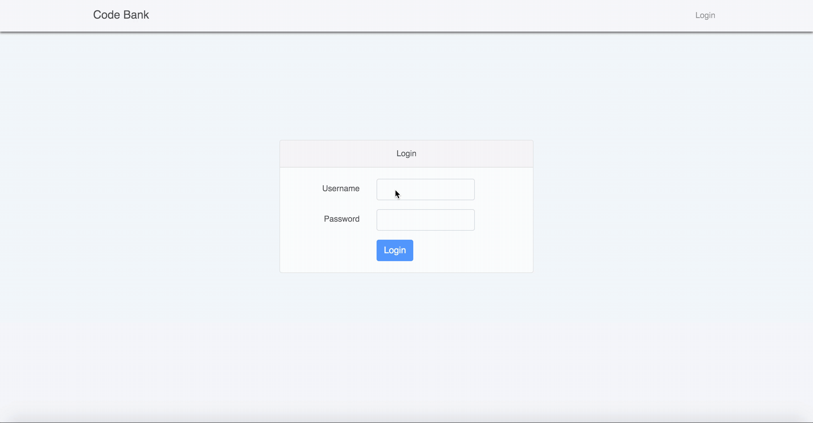

# Build a secure microservices based application using API Connect and App Connect

In a microservices based solution, security and orchestration of workflows are common requirements across solutions. 

Let us consider the example of funds transfer in a personal banking scenario. The customer wishing to perform a funds transfer must be securely authenticated and authorized to perform the operation. Also, the funds transfer functionality requires integration with other applications or APIs to complete a transaction. 

In this code pattern, we demonstrate the security and orchestration of microservices using a personal banking use-case scenario. The IBM API Connect and IBM App Connect available on IBM Cloud is used to implement the functionality. API Connect is used to provide OAuth based authorization security to microservices, and App Connect Enterprise for easier and seamless integration of APIs (with zero code) for a business user. The solution comprises authentication and funds transfer functionality.

At the end of this code pattern, users will understand:
* Authentication and authorization using OAuth in API Connect.
* Funds transfer operation with orchestration of APIs exposed by `Account Management Service`, `Credit Account Service` and `Debit Account Service` using App Connect.
* To build and deploy Node.js microservices on IBM Kubernetes Service.
* Development of a client application using Node-RED.

The `Public Access Code` scheme of OAuth2 is used for authorization. Since the customer has to authorize the operation, the public scheme is suitable as the application is incapable of maintaining the secrecy of the client secret. In the access code flow, the application has the user provide authorization through a form provided by the gateway server, which, if they grant authorization, provides an authorization code to the application.

In the funds transfer scenario, the following operations are orchestrated using `App Connect` flow:
- Balance check using `Account Management Service`.
- Perform a debit of customer account using `Debit Account Service`.
- Perform a credit of payee account using `Credit Account Service`.

In case of a failure in the credit operation, the transaction is rolled back and the amount is credited back to the customer account.

# Flow


1. User logs-in to the client application.
2. Login Request will go to API Connect.
3. API Connect uses Login API for authentication. And then it generates OAuth token for authorization.
4. The user invokes the `funds transfer` transaction using the OAuth token. The request goes to app connect flow which internally uses `Account Management API`, `Credit Account API` and `Debit Account API`. 

> Note:
>  * All microservices are deployed on IBM Kubernetes Service.
>  * All APIs interact with MongoDB.

# Pre-requisites
* [IBM Cloud Account](https://cloud.ibm.com)
* [Git Client](https://git-scm.com/downloads) - needed for clone commands.

# Steps

Follow these steps to setup and run this code pattern. The steps are described in detail below.

1. [Get the code](#1-get-the-code)
2. [Create IBM Cloud Services](#2-create-ibm-cloud-services)
3. [Setup environment for Kubernetes CLI](#3-setup-environment-for-kubernetes-cli)
4. [Deploy Mongo DB](#4-deploy-mongo-db)
5. [Deploy Microservices](#5-deploy-microservices)
6. [Configure App Connect](#6-configure-app-connect)
7. [Configure API Connect](#7-configure-api-connect)
8. [Deploy client application](#8-deploy-client-application)
9. [Analyze the result](#9-analyze-the-result)

## 1. Get the code

- Clone the repo using the below command.
   ```
   git clone https://github.com/IBM/microservices-using-apiconnect-and-appconnect.git
   ```
   
## 2. Create IBM Cloud Services

### Create IBM Kubernetes Service

Create a Kubernetes cluster with [Kubernetes Service](https://cloud.ibm.com/containers-kubernetes/catalog/cluster) using IBM Cloud Dashboard. This pattern uses the _free cluster_.

  

  > Note: It can take up to 15-20 minutes for the cluster to be set up and provisioned.  
  
### Create App Connect service instance

Create an instance of [IBM App Connect](https://cloud.ibm.com/catalog/services/app-connect). Ensure `lite` plan is selected. Click `Create`.



A new instance of IBM App Connect should be created.

### Create API Connect service instance

Create an instance of [IBM API Connect](https://cloud.ibm.com/catalog/services/api-connect). Ensure `lite` plan is selected. Click `Create`.



A new instance of IBM API Connect should be created.

### Create Node-RED service instance

Create an instance of [Node-RED](https://cloud.ibm.com/catalog/starters/node-red-starter). Ensure `lite` plan is selected. Click `Create`.



A new instance of Node-RED should be created.

**Note the base url of Node-RED** as shown below:



## 3. Setup environment for Kubernetes CLI

**Check status of your Kubernetes Cluster**

  * Check the status of your cluster `IBM Cloud Dashboard -> Clusters -> <your cluster>`. If status is not `Normal`, then you need to wait for some more time to proceed further.
    
  * Once your cluster is ready, open the access tab `IBM Cloud Dashboard -> Clusters -> <your cluster> -> Access`. Perform the steps provided under this section to get access of your cluster through `kubectl` CLI.
    
  * Verify that the kubectl commands run properly with your cluster by checking the Kubernetes CLI server version.

    ```
    $ kubectl version  --short
    Client Version: v1.14.6
    Server Version: v1.16.7+IKS
    ```

 **Get the public IP for Kubernetes Cluster**
 
 Once cluster is up and running then find out the public IP of your cluster. It will be required for further steps.

  * Go to `IBM Cloud Dashboard -> Clusters -> <your cluster>`. It gives you details of the cluster.

  * Access `Worker Nodes` tab, it will show you the public IP of your cluster as shown in below screenshot.

    
  
   Make a note of this public IP. It will be used in further steps.
   
 **Create namespace on IBM Cloud container registry**
 
 IBM Cloud Container Registry is used to store and access private container images. If you have not created namespace before or you want to use a different
 namespace than existing one, then need to create a new namespace. You can create a namespace through interface as 
 `Navigation > Kubernetes > Registry > Namespaces > Create` or using the following CLI commands:
 
 ```
   # To create a namespace
   $ ibmcloud cr namespace-add <my_namespace>
 
   # To verify that namespace is created
   $ ibmcloud cr namespace-list
 ```

## 4. Deploy Mongo DB

In this pattern, mongo db will be deployed in a container and will be used by all the microservices. Perform the following steps to deploy Mongo DB in a container.

```
   $ cd mongodb
   $ kubectl create -f deploy_mongodb.yaml
```

After deployment, the status can be checked as:
```
   $ kubectl get pods
   NAME                    READY   STATUS    RESTARTS   AGE
   mongo-8dc7685d7-nxrcr   1/1     Running   0          73s

   $ kubectl get services |grep mongo
   mongo        NodePort    172.21.84.39   <none>        27017:32643/TCP   11m
```

The **connection_url** to connect to mongodb will use `<public_ip_of_cluster>:<mongo_service_port>`. Use the public IP of your Kubernetes cluster retrieved in step 3 above. The mongo_service_port in this case, is 32643 (as shown in the above command). This connection url will be used by microservices to connect with mongo db.

## 5. Deploy Microservices

For this application, we are creating microservices for authentication (login), bank account management, credit account and debit account functionality. A set of user credentials and bank account details are pre-defined in Mongo DB. 

Perform the following steps to deploy microservices.

**Update MongoDB Connection String**

Prepare connection url as explained in step 4. Then execute the following commands to update mongo db connection url in app.js of all four microservices as per your system(linux/mac). 

```
   ## For MAC
   cd microservices
   sed -i '' s#CONNECTION_URL#x.x.x.x:port# login_service/app.js
   sed -i '' s#CONNECTION_URL#x.x.x.x:port# account_management_service/app.js
   sed -i '' s#CONNECTION_URL#x.x.x.x:port# debit_service/app.js
   sed -i '' s#CONNECTION_URL#x.x.x.x:port# credit_service/app.js  
   
   ## For Linux
   cd microservices
   sed -i s#CONNECTION_URL#x.x.x.x:port# login_service/app.js
   sed -i s#CONNECTION_URL#x.x.x.x:port# account_management_service/app.js
   sed -i s#CONNECTION_URL#x.x.x.x:port# debit_service/app.js
   sed -i s#CONNECTION_URL#x.x.x.x:port# credit_service/app.js
```

**Prepare deploy target**

All four docker images needs to be pushed to your docker image registry on IBM Cloud. You need to set the correct deploy target. Depending on the region you have created your cluster in, your URL will be in the following format:

```
   <REGION_ABBREVIATION>.icr.io/<YOUR_NAMESPACE>/<YOUR_IMAGE_NAME>:<VERSION>
```

The following command tells you the Registry API endpoint for your cluster. You can get region abbreviation from the output.

```
   ibmcloud cr api
```

To get namespace use the following command:
```
   ibmcloud cr namespaces
```

For example, to deploy the login microservice to my docker image registry in the US-South region, my deploy_target will be:
```
   us.icr.io/test_namespace/login_app:v1.0
```

**Deploy login microservice**

Execute the following steps.

```
$ cd login_service
```
Build dockerfile and push the image to registry.

```
$ ibmcloud cr build -t <DEPLOY_TARGET> .
```

Update image location(deploy target) in `deploy.yaml`.

```
$ sed -i '' s#IMAGE#<DEPLOY_TARGET># deploy.yaml     ## mac
OR
$ sed -i s#IMAGE#u<DEPLOY_TARGET># deploy.yaml      ## linux

$ kubectl create -f deploy.yaml 

$ kubectl get services|grep login
login-service   NodePort    172.21.113.169   <none>        8080:32423/TCP    31s
```

The login microservice will be accessible at `http://<public_ip_of_cluster>:<login_service_nodeport>`. Use the public IP of your Kubernetes cluster retrieved in step 5. The login_service_nodeport in this case is 32423 (shown in above command). To use login functionality of this service, access `http://<public_ip_of_cluster>:32423/login`.


**Deploy account_management service**

Following are the steps for account_management service.

```
  cd account_management_service
  $ ibmcloud cr build -t <DEPLOY_TARGET> .
  
  $ sed -i '' s#IMAGE#<DEPLOY_TARGET># deploy.yaml    ## mac
  OR
  $ sed -i s#IMAGE#u<DEPLOY_TARGET># deploy.yaml     ## linux
  
  $ kubectl create -f deploy.yaml 

  $ kubectl get services | grep acc
  account-details-service   NodePort    172.21.166.106   <none>        8080:32424/TCP    33s
```
Account management functionality of this service can be accessed by using `http://<public_ip_of_cluster>:32424/check_accounts`.

**Deploy debit_account service**

Following are the steps for debit account service.

```
  cd debit_service
  $ ibmcloud cr build -t <DEPLOY_TARGET> .
  
  $ sed -i '' s#IMAGE#<DEPLOY_TARGET># deploy.yaml     ## mac
  OR
  $ sed -i s#IMAGE#u<DEPLOY_TARGET># deploy.yaml      ## linux
  
  $ kubectl create -f deploy.yaml 

  $ kubectl get services |grep debit
  debit-account-service     NodePort    172.21.138.208   <none>        8080:32425/TCP    16s
```

Debit account functionality of this service can be accessed by using `http://<public_ip_of_cluster>:32425/debit_account`.

**Deploy credit_account service**

Following are the steps for credit account service.

```
  cd credit_service
  $ ibmcloud cr build -t <DEPLOY_TARGET> .
  
  $ sed -i '' s#IMAGE#<DEPLOY_TARGET># deploy.yaml    ## mac
  OR
  $ sed -i s#IMAGE#u<DEPLOY_TARGET># deploy.yaml     ## linux
  
  $ kubectl create -f deploy.yaml 

  $ kubectl get services|grep credit
  credit-account-service    NodePort    172.21.51.254    <none>        8080:32426/TCP    11s
```

Credit account functionality of this service can be accessed by using `http://<public_ip_of_cluster>:32426/credit_account`

> Note: We have defined NodePort of all four microservices. Please change the ports if not available in your Kubernetes Cluster.

## 6. Configure App Connect

Use App Connect to connect your different applications and make your business more efficient. Set up flows that define how data is moved from one application to one or more other applications. App Connect supports a range of skill levels and interfaces, giving you the flexibility to create integrations without writing a single line of code. You can use a web user interface or drop resources into a toolkit that gives a broader range of configuration options. Your entire organization can make smarter business decisions by providing rapid access, visibility, and control over data as it flows through your business applications and systems from a single place - App Connect. Find more App Connect resources in [Learn More](#app-connect-resources-links-for-basic-familiarty) section.

Following image shows App Connect flow for funds transfer functionality and the steps in the below sub-sections explain how to import/develop this flow.


#### Import API interfaces and flow
- On IBM Cloud dashboard, click the App Connect service instance created in earlier step and will be be listed under `Cloud Foundry Services`
- Click `Launch App Connect` button on the App Connect Service home page.

#### Add APIs to Catalog
The [OpenAPI Specification](https://github.com/OAI/OpenAPI-Specification), previously known as the Swagger Specification, is a definition format for describing REST APIs. You can import OpenAPI documents that contain API definitions into IBM App Connect. Each imported document is added as an API to the App Connect catalog of applications and APIs, and can be used to call the API from a flow.

For the microservices used in this code pattern, the REST APIs definition files are available under `app-connect-resources/microservices-apis` folder. 


- On App Connect top menu, click `Catalog` -> `APIs` -> `Add your API or web service now` -> `Add an OpenAPI definition, WSDL or ZIP`
- Browse to `app-connect-resources/microservices-apis` folder and select `Account_Check.json` file.
- Specify the name to be `Account_Check`. While any unique name can be given to APIs, we will maintain the names specified here so that the flow that we will import in later steps work with the APIs, without error.
- Optional. Add a description that summarizes the function of the API.
- Click `Add`. Click `Add your API or web service now`. Click "Add an OpenAPI definition, WSDL or Zip".
- Select the `Account Check` API json file to import.
- Enter name as `Account_Check`. Enter something in Description field, if required. Then click on `Add API`.
- Expoand `Imported` and click `Connect`.
- Under `Override the hostnameand port of the Account_Check server:(optional)` enter the Account_Check microservice's IP address and port. e.g. `http://173.193.79.231:32424`.
- Click `Connect`.
- Similarly add APIs `Debit_Transaction` (name should be `Debit_Transaction`) and `Credit_Transaction` (name should be `Credit_Transaction`).
- As a sanity check, verify that the microservices are working fine using a REST client like postman.

#### Import flow
- Click `Import Flow` button. The flow should be imported now.
- On the top right corner of the browser page, click the `New` button and select `Import Flow...`.

- Click "Add a YAML file". Browse the cloned repository and select `Flow.yaml` file in `app-connect-resources` folder. 

- When imported click on `Operations` tab -> `Edit Flow` button and verify that there are no visible error indicator.
- You have imported the flow.

#### Test the imported flow
- Now that you have imported the flow, you need to test it.
- Navigate to App Connect dashboard and start the flow.

- Click on the flow on App Connect Dashboard.
- Click `Manage` tab.
- Scroll to the bottom of the page to `Sharing Outside of Cloud Foundry organization` section. Click `Create API Key`.
- Enter a name under `Descriptive name` field and click `Create`.
- `API Portal Link` is populated with a link. Click on that link.
- On the right hand side panel, click on `Try it` link. 
- Under `Parameters -> Data`, enter the input data for rest service and click `Call Operation`. 
- Scroll a little down and you should see response from the service. Response Code should be `200 OK`.


#### Export the App Connect Flow Rest interface
- Navigate to App Connect dashboard.
- Click on the flow on App Connect Dashboard.
- Click `Manage` tab.
- Scroll a little until you find `API Info` section.
- Click `API Definition` that is available on the right side of the page, to see the options. Click `Export JSON File` and save the json file. This file is needed by API Connect to invoke requests to App Connect flows.


## 7. Configure API Connect

**Note the end point url on API Connect**
- On the API Connect Dashboard, click on `Sandbox`.
- Click on `Settings`.
- Click on `Gateways`.
- Note the `Endpoint` url.



**Create API for OAuth**
- On the API Connect Dashboard, click on `Drafts`.
- Click on `APIs`
- Click on `Add` and select `Import API from a file or URL`.
- Click on `Or import from URL...`.
- Enter the url  `https://raw.githubusercontent.com/IBM/microservices-using-apiconnect-and-appconnect/master/api-connect-resources/oauth_endpoint.yaml`.
- The design tab for the API opens. Click on `OAuth 2`.
- Scroll down to the `Authentication` section. For the `Authentication URL`, specify the login microservice url noted in the `Deploy login microservice` section.
- Click on `Save` icon.


**Create API for Funds Transfer**

We will use the file exported in the step `Export the App Connect Flow Rest interface` earlier.
- On the API Connect Dashboard, click on `Drafts`.
- Click on `APIs`
- Click on `Add` and select `Import API from a file or URL`.
- Click on `Browse` and select the file exported earlier from App Connect interface.
- Click on `Import`.
- The design tab for the API opens. Click on `Security Defintions`.
- Click on `+` and select `OAuth` to create a new OAuth definition.
- Scroll down to `Flow` section. Select `Access code`.
- For `Authorization URL` enter the following URL - `http://[the end point url for API Connect noted earlier]/oauth-end/oauth2/authorize'.
- For `Token URL` enter the following URL - `http://[the end point url for API Connect noted earlier]/oauth-end/oauth2/token'.
- In the `Scopes` section, click on `+` to add a new scope.
- Enter `funds_transfer` for the name.
- Enter a description
- Scroll down to the `Security` section. Select the newly created `OAuth` definition. The scope `funds_transfer` will get automatically selected.
- Click on `Save` icon.


**Note the funds transfer endpoint url**

On the funds transfer `Design` page:
- Click on `Base Path` and note the base path.
- Click on `Paths` and note the path.
The funds transfer api endpoint url is [End point url for API Connect noted earlier]/[Base Path]/[Path].

It should look like - https://api.au-syd.apiconnect.appdomain.cloud/.../sb/Z1ZFXl/Fund_Transfer.
 
  
   
**Create a product and publish**

Go to `Drafts` and select `Products`.
- Click on `Add + New Product`.
- Enter `Title`, `Name` and `Version`. Click `Create`.
- The `Design` page opens.
- On the `Design` page, select `APIs`.
- Click on `+` to add APIs.
- Select both `OAuth endpoint` API and `Funds Transfer` API.
- Click on `Save` icon.
- Click on `Stage` icon and select `Sandbox`.
- Go to `Dashboard`.
- Click on `Sandbox`.
- Click on the staged product.
- Select `Publish` from the menu.
- On the `dialog` that appears, click on `Publish` to publish the product.

 
 
**Create an app on developer portal**

- On the `Sandbox` dashboard, click on `Settings`.
- Click on `Portal`.
- Click on the `Portal` link.
- On the portal page, click on `Create an account`.
- Enter all the details and click `Create new account`.
- Activate the account using the sent email.
- Login to the portal with the chosen username and password. Click `Log-in`.
- Click on `Apps`.
- Click on `Create an App`.
- Enter the `Title` and `Description`. For the `OAuth Redirect URI`, enter http://[Node RED Base URL noted earlier]/client.
- Click `Submit`.
- Note the `Client ID` generated for the created `App`.

 

**Subscribe to a plan**

On the developer portal, click on `API Products`.
- Click on the product that we created earlier.
- Click on `Subscribe` to subscribe to the default plan.

 

## 8. Deploy client application

**Import the Node-RED flow and deploy**

The Node-RED flow is available at: https://raw.githubusercontent.com/IBM/microservices-using-apiconnect-and-appconnect/master/client-app/node-red-flows/flows.json

- Copy the raw contents from https://raw.githubusercontent.com/IBM/microservices-using-apiconnect-and-appconnect/master/client-app/node-red-flows/flows.json to the clipboard.
- Go to the Node-RED flow editor.
- Select `Import` and then `Clipboard` from menu.
- Paste the copied contents.
- Click on `Import`.
- Click on `Deploy` to deploy the Node-RED flow.

 

**Configure the application**

Go to the URL: http://[Node-RED base url noted earlier]/configureui.
Enter all the details and click `Configure`.
 

## 9. Analyze the result

As mentioned in `step 5`, a set of user credentials and bank account details are pre-defined in Mongo DB. 

Following are the users details (already saved in db):
```
   {_id: "user1", password: "user1"}
   {_id: "user2", password: "user2"}
   {_id: "user3", password: "user3"}
```

Predefined accounts details are:
```
   {_id: "121", accountholder: "John", funds: 25000}
   {_id: "122", accountholder: "Tim", funds: 15000}
   {_id: "123", accountholder: "Joseph", funds: 250000}
   {_id: "124", accountholder: "Mary", funds: 200000}
```

These users and account details can be used to use/test the application.

Launch the application URL : 
```
   https://<Node-RED base url noted earlier>/login
```

- Enter username and password
- Click `Allow Access` on the pop-up. The OAuth based authorization uses the `public access code` scheme. 
- Choose option - `Transfer funds to another account`.
- Enter all the details for transfer.
- Click `Transfer`.

 

## Learn More

- [Securing an API by using OAuth 2.0](https://www.ibm.com/support/knowledgecenter/en/SSFS6T/com.ibm.apic.toolkit.doc/tutorial_apionprem_security_OAuth.html)
- Introduction to App Connect on Cloud https://developer.ibm.com/integration/docs/app-connect/
- OpenAPI APIs https://developer.ibm.com/integration/docs/app-connect/how-to-guides-for-apps/use-ibm-app-connect-openapi/
- Creating flows for APIs https://developer.ibm.com/integration/docs/app-connect/tutorials-for-ibm-app-connect/creating-flows-api/
- Calling API in a flow https://developer.ibm.com/integration/docs/app-connect/creating-using-apis/calling-apis-flow/
- Toolbox flow https://developer.ibm.com/integration/docs/app-connect/toolbox-utilities/adding-conditional-logic-flow/

<!-- keep this -->
## License

This code pattern is licensed under the Apache Software License, Version 2. Separate third-party code objects invoked within this code pattern are licensed by their respective providers pursuant to their own separate licenses. Contributions are subject to the [Developer Certificate of Origin, Version 1.1 (DCO)](https://developercertificate.org/) and the [Apache Software License, Version 2](https://www.apache.org/licenses/LICENSE-2.0.txt).

[Apache Software License (ASL) FAQ](https://www.apache.org/foundation/license-faq.html#WhatDoesItMEAN)

