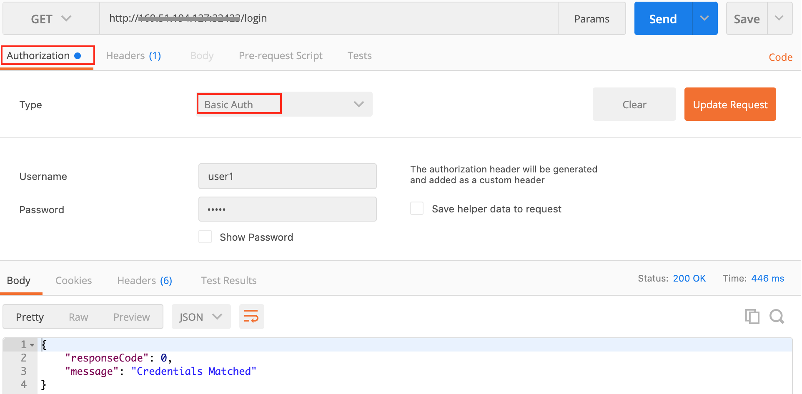
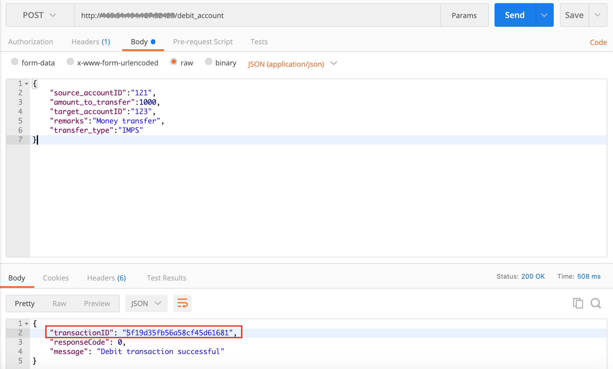
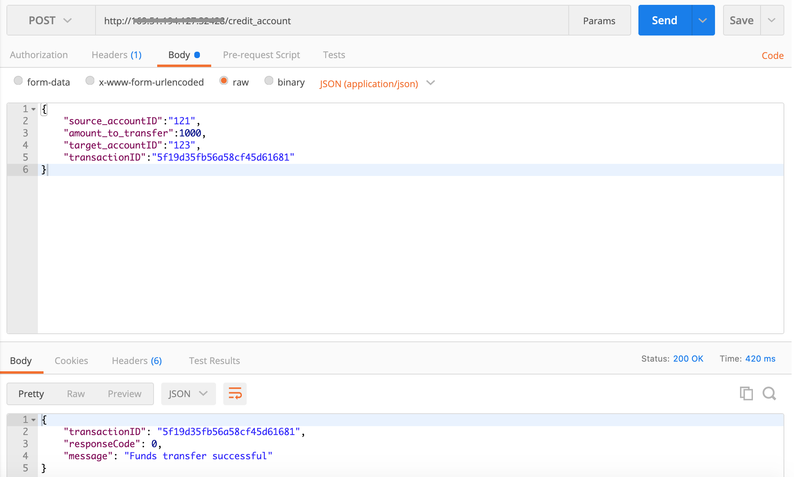

## Testing of Microservices

The deployed microservices can be tested using a tool which enables people to test calls to APIs or using `curl` command. Here we are using `Postman` tool and also providing curl commands for test. Follow the below steps to test your deployed microservices.

The microservices can be accessed by using `http://<public_ip_of_your_cluster>:<nodeport_of_your_service>`.

For example, accessing the debit account microservice url will return something like this on your browser.


The following set of user credentials and the bank account details are already populated in Mongo DB to use/test the microservices.

*Users details*

```
   {_id: "user1", password: "user1"}
   {_id: "user2", password: "user2"}
   {_id: "user3", password: "user3"}
```

*Accounts details*

```
   {_id: "121", accountholder: "John", funds: 25000}
   {_id: "122", accountholder: "Tim", funds: 15000}
   {_id: "123", accountholder: "Joseph", funds: 250000}
   {_id: "124", accountholder: "Mary", funds: 200000}
```

**Login Service**

Following snapshot shows the given input and the output for the login microservice.



Login service uses Basic authorization. If you want to test using curl command, you need to encode username and password before submitting the request.
The curl command for login service is:

```
  curl -X GET \
    http://<ip>:<port>/login \
    -H 'authorization: Basic dXNlcjE6dXNlcjE=' \
    -H 'cache-control: no-cache' \
    -H 'postman-token: 948cfb36-4b9d-ac31-7a0f-124615396c5c'
```

**Account Management Service**

The below snapshot shows the input and the output for the account management microservice.


Here, input json is -
```
  {
    "source_accountID":"121",
    "amount_to_transfer":1000,
    "target_accountID":"123"
  }
```

Alternate curl command is - 

```
  curl -X POST \
    http://<ip>:<port>/check_accounts \
    -H 'cache-control: no-cache' \
    -H 'content-type: application/json' \
    -H 'postman-token: 547d7a27-ad1e-eafb-ca48-3a58bfc16dc6' \
    -d '{
    "source_accountID":"121",
    "amount_to_transfer":1000,
    "target_accountID":"123"
  }'
```

Corresponding pod logs can be checked for more details.

```
  $ kubectl get pods
  $ kubectl logs -f <podname>
  
  # account_management_service pod will show something like this -

  {"source_accountID":"121","amount_to_transfer":1000,"target_accountID":"123"}
  Mongo DB connection successful
  Target account exists -  [ { _id: '123', accountholder: 'Joseph', funds: 250000 } ]
  Source account exists -  [ { _id: '121', accountholder: 'John', funds: 25000 } ]
  Sufficient funds to transfer
  {"responseCode":0,"message":"Sufficient funds to transfer"}
```

**Debit Account Service**

It shows the input and the output for the debit account microservice.



Input JSON to API is -
```
  {
    "source_accountID":"121",
    "amount_to_transfer":1000,
    "target_accountID":"123",
    "remarks":"Money transfer",
    "transfer_type":"IMPS"
  }
```

The curl command for the same:
```
  curl -X POST \
    http://<ip>:<port>/debit_account \
    -H 'cache-control: no-cache' \
    -H 'content-type: application/json' \
    -H 'postman-token: bc5b3749-d101-0ceb-98a3-f6541353cff3' \
    -d '{
    "source_accountID":"121",
    "amount_to_transfer":1000,
    "target_accountID":"123",
    "remarks":"Money transfer",
    "transfer_type":"IMPS"
  }'
```

Make a note of the transaction ID after successful debit transaction and provide this transaction ID for credit transaction to complete the funds transfer from one account to another.

**Credit Account Service**

It shows the input and the output for the credit account microservice.



Input JSON to API is -
```
  {
	"source_accountID":"123",
	"amount_to_transfer":1000,
	"target_accountID":"121",
	"transactionID":"5f19d77bb56a587c07d61683"
  }
```

The curl command for the same:
```
  curl -X POST \
    http://<ip>:<port>/credit_account \
    -H 'cache-control: no-cache' \
    -H 'content-type: application/json' \
    -H 'postman-token: b3ca812d-70ad-bf66-4bde-afd255444d48' \
    -d '{
    "source_accountID":"123",
    "amount_to_transfer":1000,
    "target_accountID":"121",
    "transactionID":"5f19d77bb56a587c07d61683"
  }'
```


Additionally the appropriate pod logs can be checked for more details of the transaction.


